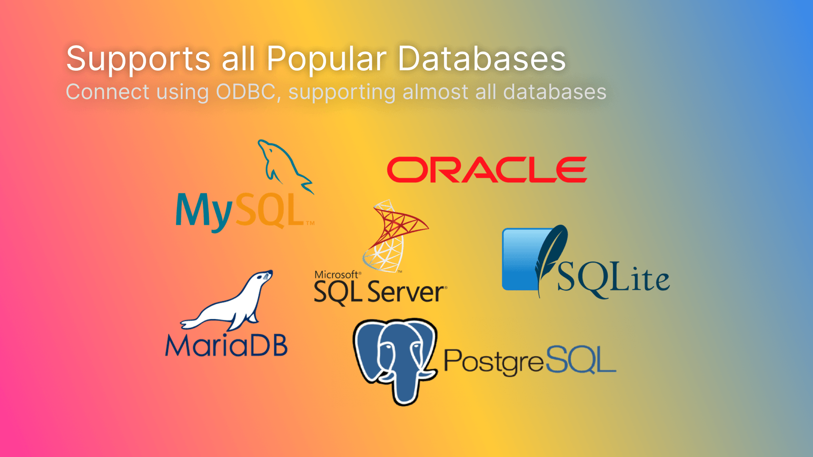

## SQL Connector

> A database connector for Unreal Engine

# Introduction
`SQL Connector` allows you to easily connect to and query your database from Blueprints and C++. Check out the [setup guide](/setup).

# Features
- Connect to your database from Unreal Engine
- Efficient pooling system to avoid bottleneck
- Blueprints & C++ support
- Parameters escaping
- Wide database support

!> Get started by reading the [setup guide](/setup).
