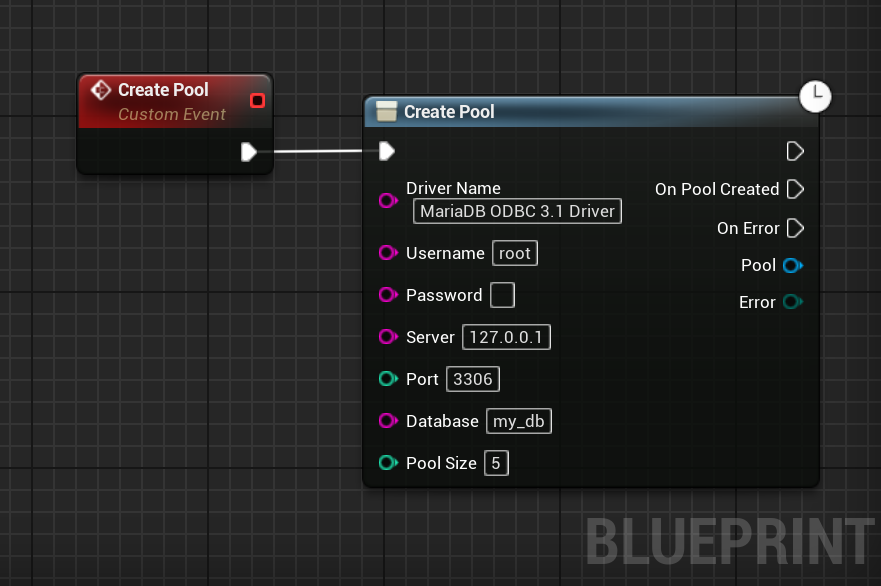
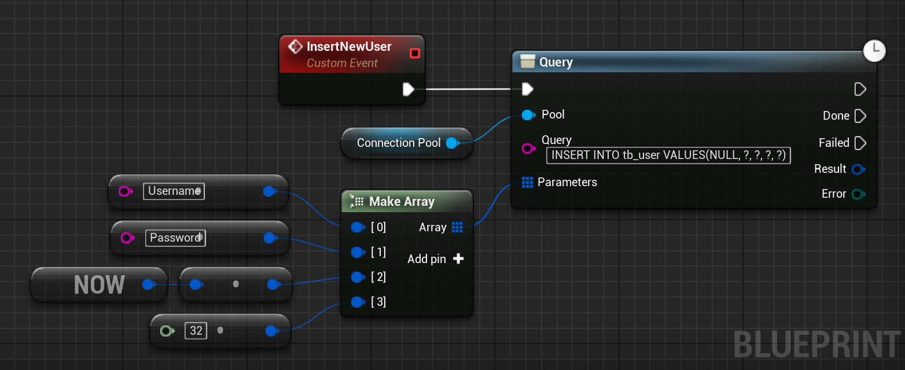

# Code Example
This section contains several code examples to get you started using `Database - Connector (ODBC)`.

# Blueprints
## Creating a Pool
A pool is a list of connected clients to a database. It allows to have and use multiple connections without having to manage 
them and prevents the additional connection cost.

The parameters are the following:
1. **DriverName**: The name of your driver. See [this part](/setup?id=getting-the-odbc-driver39s-name) of the documentation.
2. **UserName**: The username used to authenticate agaisnt your database.
3. **Password**: The password used to authenticate agaisnt your database. Leave empty for none.
4. **ServerAddress**: The address where your database is accessible.
5. **ServerPort**: The port where your database is accessible.
6. **DatabaseName**: The name of the database to connect to.
7. **PoolSize**: The size of the pool. It represents the number of simultaneous connections your application will be able to maintain and use in parallel.



## Query your Database
To query the Database, use the `Query` node of your pool.
This method requires three parameters:
1. **Query**: The SQL query to execute. Use `?` to reference a parameter.
2. **Parameters**: The parameters for our query. Inserted following the order of the `?` in the query.  

  

## Parsing Results

Once you querried your database, you can get your data. To do so, several methods are available.


?> The `FQueryResult` struct is cheap to copy, it references internally a shared data set. 

?> The `FQueryResult` struct is thread-safe; you can safely copy it across threads.

# C++
## Creating a Pool
A pool is a list of connected clients to a database. It allows to have and use multiple connections without having to manage 
them and prevents the additional connection cost.

The parameters are the following:
1. **DriverName**: The name of your driver. See [this part](/setup?id=getting-the-odbc-driver39s-name) of the documentation.
2. **UserName**: The username used to authenticate agaisnt your database.
3. **Password**: The password used to authenticate agaisnt your database. Leave empty for none.
4. **ServerAddress**: The address where your database is accessible.
5. **ServerPort**: The port where your database is accessible.
6. **DatabaseName**: The name of the database to connect to.
7. **PoolSize**: The size of the pool. It represents the number of simultaneous connections your application will be able to maintain in parallel.
8. **Callback**: Called when the pool has been create or when an error occured.

The following code shows how to create a pool in C++:
```cpp
#include "Database/Pool.h" // For UDatabasePool class.

void UMyClass::CreateMyPool()
{
    UDatabasePool::CreatePool
    (
        TEXT("MariaDB ODBC 3.1 Driver"), // Driver Name
        TEXT("root"),                    // Username
        TEXT(""),                        // Password
        TEXT("127.0.0.1"),               // Database Server
        3306,                            // Database Port
        TEXT("my_database"),             // Database Name
        5,                               // Pool Size

        // Callback called when the pool has been created.
        FDatabasePoolCallback::CreateLambda([](EDatabaseError Error, UDatabasePool* Pool) -> void
        {
            if (Error == EDatabaseError::None)
            {
                // We have a connected pool.
            }
            else
            {
                // Pool creation failed.
                // Check Error or the Output log to know why.
            }
        })
    );
}
```
## Query your Database
To query the Database, use the `Query` method of your pool.
This method requires three parameters:
1. **Query**: The SQL query to execute. Use `?` to reference a parameter.
2. **Parameters**: The parameters for our query. Inserted following the order of the `?` in the query.
3. **Callback**: The callback called when the query is over (either success or fail).

The following code shows a basic use case:
```cpp
void UMyClass::InsertNewUser()
{
    TArray<FDatabaseValue> QueryParameters = 
	{
		TEXT("Username"),
		TEXT("MyHashedPassword"),
		FDatabaseDate::Now(),
		10
	};

	Pool->Query
	(
		TEXT("INSERT INTO tb_user VALUES (NULL, ?, ?, ?, ?)"),  // SQL query
		QueryParameters,										// SQL parameters
		
		// Callback executed when query 
		FDatabaseQueryCallback::CreateLambda([](EDatabaseError Error, const FQueryResult& Result) -> void
		{
			if (Error == EDatabaseError::None)
			{
				// Query executed.
			}
			else
			{
				// Query failed to execute.
			}
		})
	);
}
```

## Parsing Results
Once you querried your database, you can get your data. To do so, several methods are available.

The following code example shows the methods you can use to get your data:
```cpp
// const FQueryResult Result

// Get a single value in a row and column.
const int32   UserId   = Result.Get(0 /* ColumnIndex */, 0 /* RowIndex */);
const FString UserName = Result.Get(TEXT("username"),    0 /* RowIndex */);

// Iterate over column names.
for (const FString& ColumnName : Result.GetColumns())
{
	// ColumnName is the name of the columns in order.
}

// Prints an ASCII table with the content in the Output Log. 
// Useful for debugging.
Result.LogDump();

// Number of columns of this result.
const int32 ColumnCount = Result.GetColumnCount();

{ // Gets a whole row.
	const TArray<FDatabaseValue>* Row = Result.GetRow(1 /* RowIndex */);

	if (Row)
	{
		const int32   OtherUserId = (*Row)[0];
		const FString OtherUserName = (*Row)[1];
	}
}

// The number of rows of this result.
const int64 RowCount = Result.GetRowCount();
```

?> The `FQueryResult` struct is cheap to copy, it references internally a shared data set. 

?> The `FQueryResult` struct is thread-safe; you can safely copy it across threads.

## Complete C++ Example
This example is meant to help understand how to use the plugin in an actual use case.
###### Header file `MyClass.h`.
```cpp
// Copyright notice

#include "CoreMinimal.h"
#include "MyClass.generated.h"

// Forward declaration of the pool class.
class UDatabasePool;

UCLASS()
class MYGAME_API UMyClass : public UObject
{
  GENERATED_BODY()
public:
  // Connects to the database.
  void ConnectToDatabase();
  
  // We have a connection if the pool is not null.
  // This is pretty basic as it doesn't check the actual connection status.
  inline bool IsConnected() const 
  {
    return Pool != nullptr;
  }
  
private:
  // Callback called when the pool is created.
  void OnPoolCreated(EDatabaseError Error, UDatabasePool* NewPool);
  
  // Called after our query.
  void OnUserQueried(EDatabaseError Error, const FQueryResult& Results);
  
private:
  // Our pool ketp as UPROPERTY() to prevent garbage collection.
  UPROPERTY()
  UDatabasePool* Pool;
};
```
###### Source file `MyClass.cpp`.

```cpp
// Copyright notice

#include "MyClass.h"
#include "Database/Pool.h"


// Connects to the database.
void UMyClass::ConnectToDatabase()
{
  UDatabasePool::CreatePool
  (
    TEXT("My Driver 4.2.0"),
    TEXT("MyUsername"),
    TEXT("MyPassword"),
    TEXT("my.server.com"),
    484 /* database port */,
    TEXT("MyDatabase"),
    10 /* Pool size */,
    
    // We want to call our member method when the pool is created.
    FDatabasePoolCallback::CreateUObject(this, &ThisClass::OnPoolCreated)
  );  
}

// Callback called when the pool is created.
void UMyClass::OnPoolCreated(EDatabaseError Error, UDatabasePool* NewPool)
{
  if (Error == EDatabaseError::None)
  {
    // We are connected with a valid pool.
    Pool = NewPool;
    
    // We can now query our database.
    Pool->Query(TEXT("SELECT * FROM tb_users WHERE user = ?"), { 1 }, FDatabaseQueryCallback::CreateUObject(this, &ThisClass::OnUserQueried));
  }
  else
  {
    // An error occured.
  }
}

// Called after our query.
void UMyClass::OnUserQueried(EDatabaseError Error, const FQueryResult& Results)
{
  // We can parse Results to get our user.
}

```

