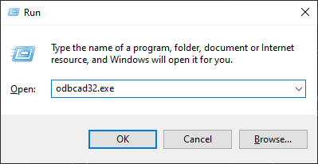
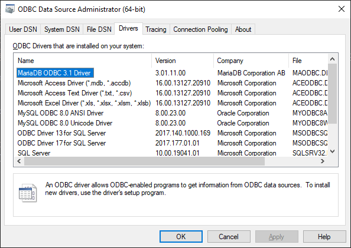

# Setup
This page will guide you on how to setup `Database - Connector (ODBC)` to connect to your database.

## Installing the ODBC driver
To connect to your database, `Database - Connector (ODBC)` uses an ODBC driver specific to your Database.
That's why you must first install the driver corresponding to your database.

This table lists the common databases and the download link of their ODBC driver:

?> You can easily find your database's ODBC driver with Google.

|Database Name| ODBC Driver URL|
|:----|:----|
|MySQL| [https://dev.mysql.com/downloads/connector/odbc/](https://dev.mysql.com/downloads/connector/odbc/)|
|MariaDB| [https://downloads.mariadb.org/connector-odbc/](https://downloads.mariadb.org/connector-odbc/)|
|PostgreSQL|[https://www.postgresql.org/download/](https://www.postgresql.org/download/)|
|MSSQL|[https://go.microsoft.com/fwlink/?linkid=2153471](https://go.microsoft.com/fwlink/?linkid=2153471)|
|Oracle|[https://www.oracle.com/database/technologies/releasenote-odbc-ic.html](https://www.oracle.com/database/technologies/releasenote-odbc-ic.html)|

!> Make sure to pick the 64-bits driver.

## Getting the ODBC Driver's Name
Now that the driver is installed on your machine, you need to get the exact driver's name.
To do so:
1. Use the `WIN + R` shortcut to open the `Run` window.
2. Enter `odbcad32.exe` to open the `ODBC Data Source Administrator (64-bit)` window.  
 

3. Under the `Driver` section, identify the driver you install and note somewhere the exact name of your driver (version number included).  

?> In the example, the name to remember is `MariaDB ODBC 3.1 Driver`.

4. You now have to use this name when connecting to your Database using Blueprints and/or C++.

!> If the driver corresponding to your database doesn't show up, it probably means that the 64-bits version isn't installed on your machine.